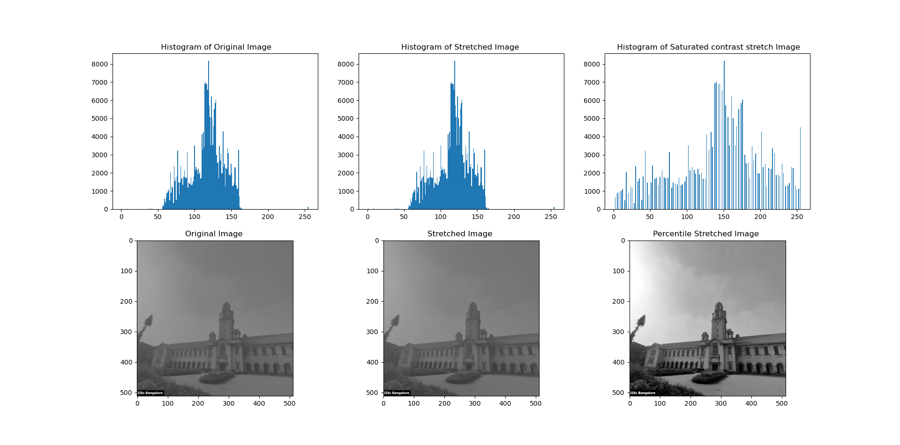

# saturated-contrast-stretching
 technique for improving the contrast of an image by stretching the pixel values to the full range of possible values (0 to 255). The operation works by first finding the minimum and maximum values of the image. The minimum value is used as the lower threshold value and the maximum value is used as the upper threshold value. The pixels that are below the lower threshold value are set to the lower threshold value. The pixels that are above the upper threshold value are set to the upper threshold value. The pixels that are between the lower and upper threshold values are linearly mapped to the range 0 to 255.

